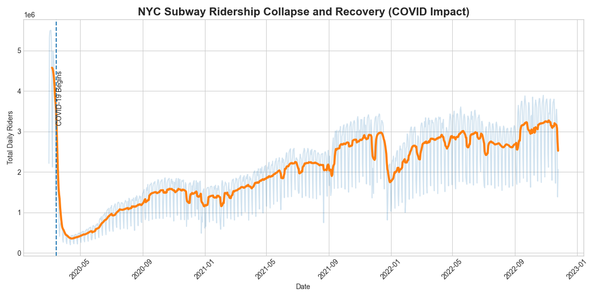
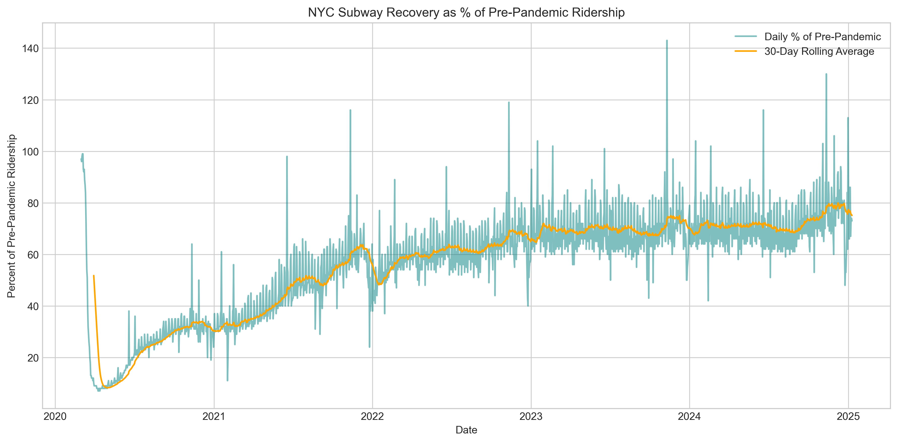

# 🚇 NYC Subway Ridership Analysis

## 📊 Overview
This project analyzes New York City subway ridership trends using NYC Open Data.  
It visualizes how ridership changed over time, focusing on the **impact of COVID-19** and recovery patterns.

---

## 🎯 Project Goals
- Track subway ridership trends over time  
- Visualize recovery relative to pre-pandemic baselines  
- Highlight trends using a **30-day rolling average** to smooth daily fluctuations

---

## 🛠 Tools Used
- Python  
- Pandas for data cleaning & analysis  
- Matplotlib for visualization  
- Jupyter Notebook for interactive exploration

---

## 🔑 Key Insights
- Subway ridership **dropped sharply** in March 2020  
- Recovery has been **gradual with fluctuations**  
- Rolling averages **highlight overall trends** and smooth daily volatility

---

## 📈 Visualizations

### 1️⃣ Total Subway Ridership Over Time

  

*Daily ridership trends from 2020–2025, showing collapse in March 2020 and gradual recovery.*

---

### 2️⃣ Rolling Recovery Percent

  

*Subway ridership as a percentage of comparable pre-pandemic days, using a 30-day rolling average.*

---

## 📒 Notebook
Full analysis, data cleaning, and plotting code are in the Jupyter Notebook:  
[`Untitled.ipynb`](Untitled.ipynb)

---

## 📚 Data Source
NYC MTA Daily Ridership, downloaded from [NYC Open Data](https://opendata.cityofnewyork.us/)

---

*This project demonstrates real-world data analysis, visualization, and communication of trends — perfect for a portfolio or resume link.*
