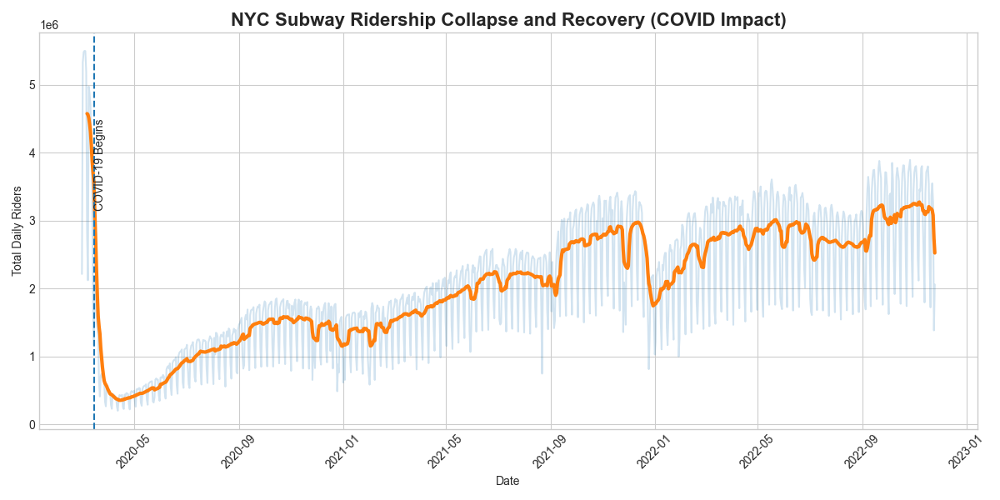
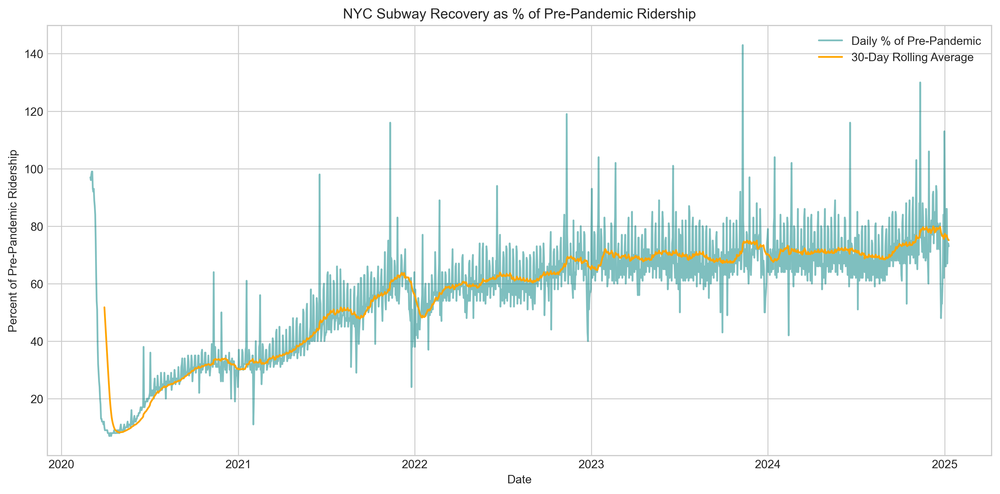

# 🚇 NYC Subway Ridership Analysis
👉 Key insight: NYC subway ridership collapsed ~90% in March 2020 and has not fully recovered to pre-pandemic levels.

Data-driven analysis of New York City subway ridership trends, focusing on the impact of COVID-19 and long-term recovery patterns.

---

## Overview

Using NYC Open Data, this analysis explores how subway usage changed during and after the COVID-19 pandemic.

The project focuses on:

- Tracking ridership trends over time  
- Comparing current usage to pre-pandemic baselines  
- Using rolling averages to smooth daily volatility  
- Visualizing long-term recovery patterns  

This project demonstrates real-world data analysis, visualization, and clear communication of insights.

## 📈 Key Visualizations

### 1️⃣ Total Subway Ridership Over Time

*Daily subway ridership showing the sharp COVID-19 collapse in March 2020 and gradual recovery.*

---

### 2️⃣ Recovery vs Pre-Pandemic Baseline

*Ridership as a percentage of pre-pandemic levels using a 30-day rolling average to highlight long-term trends.*
---

## ✨ Features

- 📊 Time-series ridership analysis  
- 📉 COVID impact visualization  
- 📈 Recovery tracking vs pre-pandemic levels  
- 🔄 30-day rolling average smoothing  
- 📊 Clear and interpretable data visualizations  

---

## 🛠 Tech Stack

- Python  
- Pandas  
- Matplotlib  
- Jupyter Notebook  

---

## 📈 Visualizations

### Total Subway Ridership Over Time
Daily ridership trends from 2020–2025, showing the sharp decline during COVID and gradual recovery.

### Rolling Recovery Percentage
Ridership expressed as a percentage of comparable pre-pandemic days using a 30-day rolling average.

---

## 📒 Analysis Notebook

Full data cleaning, analysis, and visualization code:

👉 `nyc_ridership_analysis.ipynb`

---

## 📚 Data Source

NYC MTA Daily Ridership dataset from NYC Open Data.

---

## 💡 Key Insights

- Ridership dropped sharply in March 2020  
- Recovery has been gradual with ongoing fluctuations  
- Rolling averages highlight long-term trends more clearly than daily data  

---

## 🚀 Future Improvements

- Interactive dashboard for exploring ridership trends  
- Integration with real-time transit data  
- Geographic breakdown by station or borough  

---

## 💡 Vision

This project demonstrates how real-world data can be transformed into clear, actionable insights.

It serves as a foundation for building more advanced data-driven applications, including real-time transit analysis and decision-support tools.
